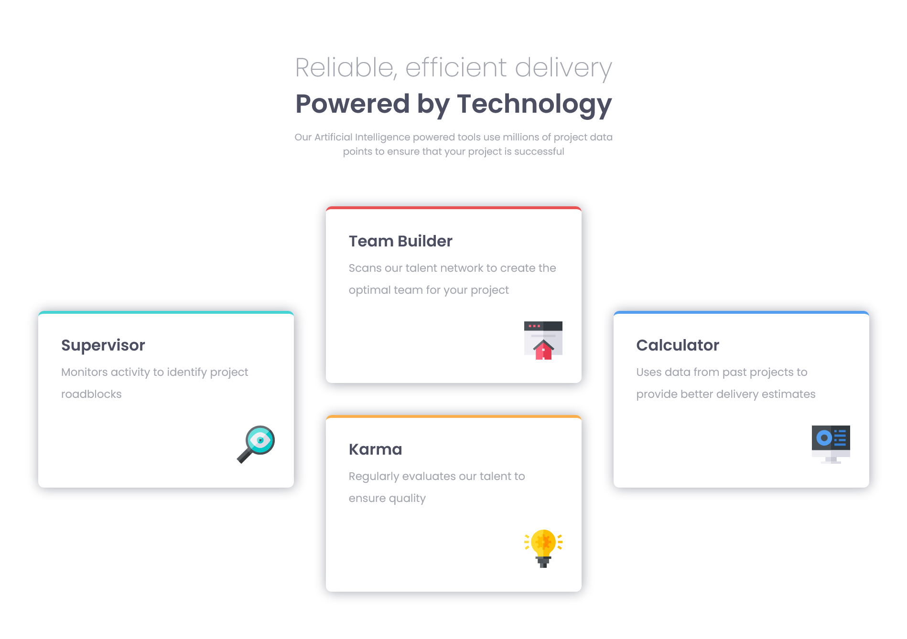
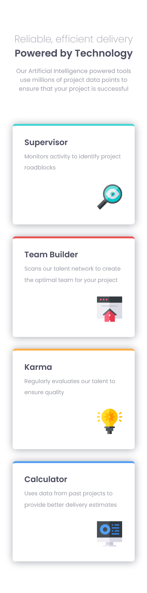

# Frontend Mentor - Four card feature section solution

This is a solution to the [Four card feature section challenge on Frontend Mentor](https://www.frontendmentor.io/challenges/four-card-feature-section-weK1eFYK). Frontend Mentor challenges help you improve your coding skills by building realistic projects.

## Table of contents

- [Overview](#overview)
  - [The challenge](#the-challenge)
  - [Screenshot](#screenshot)
  - [Links](#links)
- [My process](#my-process)

  - [Built with](#built-with)
  - [What I learned](#what-i-learned)

- [Author](#author)

## Overview

### The challenge

Users should be able to:

- View the optimal layout for the site depending on their device's screen size

### Screenshot

#### Desktop

#### Mobile

### Links

- Solution URL: [Github](https://github.com/Ibtehaj-Ali-1/Four-Card-Feature)
- Live Site URL: [Four Card Feature Section](https://four-card-feature-tawny-xi.vercel.app/)

## My process

### Built with

- Semantic HTML5 markup
- CSS custom properties
- Flexbox
- CSS Grid
- Mobile-first workflow

### What I learned

- How to use CSS Grid to create a responsive layout
- How to use Flexbox to create a responsive layout
- How to use CSS custom properties to make the code more readable and maintainable

## Author

- Website - [Ibtehaj Ali](https://github.com/Ibtehaj-Ali-1/Four-Card-Feature)
- Frontend Mentor - [@Ibtehaj-Ali-1](https://www.frontendmentor.io/profile/Ibtehaj-Ali-1)
